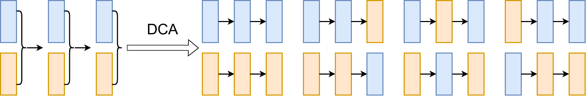

# [Deep Combinatorial Aggregation](https://github.com/tum-vision/dca)

This repository contains the source code for the NeurIPS 2022 paper "Deep Combinatorial Aggregation" by Yuesong Shen and Daniel Cremers.



[[paper](https://openreview.net/pdf?id=byMcacS8GYZ)] [[Arxiv link](http://arxiv.org/abs/2210.06436)]

## Usage

### Dependencies

This implementation has been tested with
- python 3.9.7
- pytorch 1.10.0 (cuda 11.3)
- torchvision 0.11.1

It should work with Python >= 3.6 and latest pytorch / torchvision.

### Setup
1. Prepare a python environment with the above dependencies.

2. Install the `dca` package locally by running
  ```bash
  pip install -e .
  ```
  in this folder.

3. Checkout the Python scripts in folder "[experiments](./experiments)" to run the respective experiments:
  - [cifar10](./experiments/cifar10): In-domain CIFAR-10 experiments;
  - [svhn](./experiments/svhn): In-domain SVHN experiments;
  - [cifar10c](./experiments/cifar10c): Distributional shift experiments on CIFAR-10-C;
  - [ood](./experiments/ood): Out of distribution experiments;

  Both the [CIFAR-10-C](./experiments/cifar10c) and the [OOD](./experiments/ood) experiments require pre-trained models on [CIFAR-10](./experiments/cifar10).

## Citation

```
@InProceedings{shen2022dca,
title={Deep Combinatorial Aggregation},
author={Yuesong Shen, Daniel Cremers},
booktitle = {NeurIPS},
year = {2022}
}
```
